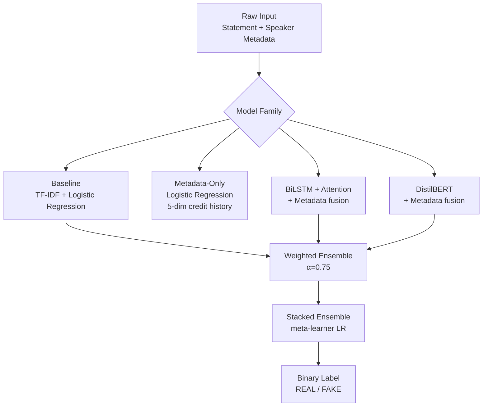

# 📰 Fake News Detection — NLP Classification with Metadata-Aware Models

A comparative NLP study on fake news classification across two benchmark datasets — **LIAR** (short political statements) and **FakeNewsNet/BuzzFeed** (full articles). Implements and evaluates four model families — TF-IDF+LR, BiLSTM with attention, DistilBERT, and stacked ensembles — with a key focus on the role of **speaker credit history metadata** in improving classification accuracy.


---

## 📌 What This Is

A systematic comparison of NLP approaches to fake news detection, implemented in a single reproducible notebook. The project goes beyond simple text classification by incorporating **speaker credibility metadata** (historical truth-telling rates) as a supplementary signal — a design choice validated by the results.

**Key finding:** A Logistic Regression model trained *only* on speaker metadata (no text) achieved **72.5% accuracy and 81.3% AUC** on the LIAR test set — outperforming both the text-only TF-IDF+LR baseline (63.9%) and the BiLSTM without metadata (61.3%). Combining metadata with neural models pushed the best result to **75.0% accuracy and 83.9% AUC**.

---

## 📊 Results

| Model | Dataset | Accuracy | F1 | AUC |
|---|---|---|---|---|
| TF-IDF + LR (text only) | LIAR test | 63.9% | 63.3% | 67.5% |
| Metadata-Only LR | LIAR test | 72.5% | 72.1% | 81.3% |
| BiLSTM (no metadata) | LIAR test | 61.3% | 61.1% | 66.1% |
| BiLSTM + Metadata | LIAR test | 75.0% | 74.6% | **83.4%** |
| DistilBERT + Metadata | LIAR test | 74.0% | 73.9% | 83.2% |
| Weighted Ensemble (α=0.75) | LIAR test | 74.3% | 74.2% | 83.7% |
| **Stacked Ensemble** | **LIAR test** | **74.9%** | **74.5%** | **83.9%** |

**Out-of-domain (OOD) evaluation — LIAR-trained models on BuzzFeed:**

| Model | Accuracy | AUC |
|---|---|---|
| TF-IDF + LR | 67.9% | 76.5% |
| DistilBERT + Metadata (mean-meta) | 64.3% | 67.9% |
| DistilBERT + Metadata (raw) | 50.0% | 67.3% |

**Takeaway:** DistilBERT collapses to random chance on OOD data when metadata is missing — TF-IDF+LR generalizes better cross-domain. Speaker metadata is a powerful in-distribution signal but doesn't transfer across corpora, which is the expected and informative result.

---

## 🏗️ Model Architecture



**Label binarization (LIAR):**
- `FAKE` ← `pants-fire`, `false`, `barely-true`
- `REAL` ← `true`, `mostly-true`, `half-true`

---

## 🧩 Models

| Model | Key Details |
|---|---|
| **TF-IDF + LR** | Text-only baseline. Unigram+bigram TF-IDF, max 50k features, L2-regularized Logistic Regression |
| **Metadata-Only LR** | 5 speaker credit-history counts (normalized proportions) + total experience proxy. No text used |
| **BiLSTM + Attention** | 2-layer BiLSTM, self-attention pooling, metadata fused at classifier head. Class-weighted loss |
| **DistilBERT + Metadata** | `distilbert-base-uncased`, CLS pooling, metadata concatenated before final linear layer. 3 runs for variance |
| **Weighted Ensemble** | Soft-probability blend of BiLSTM + DistilBERT (α=0.75 DistilBERT weight) |
| **Stacked Ensemble** | Meta-learner Logistic Regression on concatenated softmax outputs of all base models |

---

## 📚 Datasets

| Dataset | Size | Description |
|---|---|---|
| **LIAR** | 10,238 train / 1,284 val / 1,267 test | Short political statements with 6 veracity labels. Speaker identity, party, job, and 5-count credit history included |
| **FakeNewsNet / BuzzFeed** | 182 total (91 fake, 91 real) | Full news articles. Balanced. Used for in-distribution eval (70/15/15 split) and OOD transfer testing |

**Metadata features used (LIAR):**
The LIAR dataset includes a speaker's historical statement counts across 5 categories (`barely_true`, `false`, `half_true`, `mostly_true`, `pants_fire`). These are normalized to proportions and used as a 5-dimensional feature vector, plus a scalar total count as an "experience proxy." This metadata proved to be the most informative signal in the dataset.

---

## 📈 Visualizations

All plots are committed to the repository:

| File | Contents |
|---|---|
| `eda_overview.png` | Label distribution, statement length, speaker party breakdown |
| `model_comparison.png` | Accuracy and AUC comparison across all models |
| `confusion_matrices.png` | Confusion matrices for each model on LIAR test set |
| `learning_curves.png` | Train/val loss and accuracy curves for BiLSTM and DistilBERT |
| `bilstm_attention.png` | Attention weight heatmaps over input tokens |
| `lime_explanations.png` | LIME token-level importance for DistilBERT predictions |
| `metadata_contributions.png` | Feature importance of credit history dimensions |

---

## 🛠️ Tech Stack

| Layer | Technology |
|---|---|
| Language | Python 3.11 |
| Deep Learning | PyTorch |
| Transformers | HuggingFace Transformers 4.41.2 |
| Classical ML | scikit-learn |
| Text Processing | NLTK (stopwords, tokenization) |
| Explainability | LIME |
| Visualization | Matplotlib, Seaborn |
| Environment | Google Colab (Tesla T4 GPU) |
| Reproducibility | Seed 42 across `random`, `numpy`, `torch`, `cuda` |

---

## 🖥️ Running the Notebook

The project is a single self-contained notebook designed for Google Colab.

### 1. Open in Colab

Upload `fake_news_detection.ipynb` to [Google Colab](https://colab.research.google.com/) or open directly from GitHub.

### 2. Upload Datasets

When Cell 2 executes, upload both zip files:
- `LIAR.zip` — download from [LIAR dataset](https://cs.ucsb.edu/~william/data/liar_dataset.zip)
- `FakeNewsNet.zip` — download from [FakeNewsNet](https://github.com/KaiDMML/FakeNewsNet)

### 3. Run All Cells

The notebook runs sequentially:

```
Cell 1  → Install dependencies
Cell 2  → Upload and extract datasets
Cell 3  → Imports and reproducibility seeds
Cell 4  → Load and binarize LIAR + BuzzFeed
Cell 5  → Exploratory data analysis
...     → TF-IDF baseline, Metadata LR, BiLSTM, DistilBERT, Ensembles, OOD eval, LIME
```

All results are saved to `results_summary.json` and visualizations are exported as PNGs.

### Runtime

Full run requires a GPU runtime (Tesla T4 recommended). CPU-only will work but DistilBERT training will be slow.

---

## 📂 Project Structure

```
fake-news-detection/
├── fake_news_detection.ipynb      # Full experiment notebook
├── results_summary.json           # All model metrics + DistilBERT variance runs
├── eda_overview.png               # Exploratory data analysis
├── model_comparison.png           # Cross-model accuracy and AUC comparison
├── confusion_matrices.png         # Per-model confusion matrices
├── learning_curves.png            # Training dynamics for neural models
├── bilstm_attention.png           # BiLSTM attention weight visualization
├── lime_explanations.png          # LIME token importance for DistilBERT
└── metadata_contributions.png     # Credit history feature importance
```

---

## 💡 Key Findings

**1. Metadata dominates text signals on LIAR**
Speaker credit history alone (5 normalized counts, no text) achieves 72.5% accuracy — significantly better than TF-IDF+LR (63.9%) and BiLSTM without metadata (61.3%). This suggests the LIAR benchmark encodes veracity partly through *who* is speaking, not just *what* is said.

**2. Neural text models without metadata underperform**
BiLSTM on text only (61.3%) performs worse than the TF-IDF baseline (63.9%), indicating that raw BiLSTM without metadata does not extract additional useful signal from the short political statements in LIAR.

**3. Combining text + metadata is the winning strategy**
BiLSTM + Metadata (75.0%) and DistilBERT + Metadata (74.0%) both substantially outperform their text-only equivalents, confirming metadata is complementary — not redundant — with text features.

**4. DistilBERT variance is non-trivial**
Three DistilBERT runs: 74.0%, 74.2%, 73.2% accuracy — a 1.0% spread. This is worth noting when comparing models that appear close in the results table.

**5. OOD generalization breaks for transformer models**
DistilBERT + Metadata collapses to 50% (random) when transferred from LIAR to BuzzFeed without access to speaker metadata — while TF-IDF+LR holds at 67.9%. Text-domain shift, combined with the loss of the metadata signal, breaks the transformer's in-distribution advantage.

---

## 🚀 Future Directions

- [ ] Replace LIME with SHAP for more stable token-level attributions
- [ ] Experiment with RoBERTa or DeBERTa as the backbone for the transformer models
- [ ] Explore claim-speaker relationship modeling (graph-based approaches)
- [ ] Test cross-lingual fake news detection with mBERT or XLM-R
- [ ] Add a claim-network graph incorporating speaker-claim co-occurrence patterns
- [ ] Investigate temporal drift in veracity labels across the LIAR dataset

---

## 🛡️ License

This project is licensed under the [MIT License](LICENSE).

---

<p align="center">
  Built by <a href="https://github.com/Vidhya060501">Vidhyadhari Bandaru</a> ·
  <a href="https://www.linkedin.com/in/vidhyadharibandaru">LinkedIn</a> ·
  <a href="mailto:vidhyadhari060501@gmail.com">Email</a>
</p>
